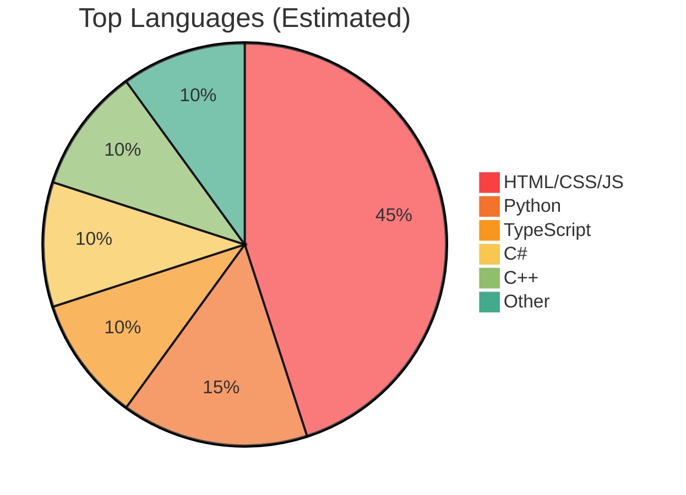
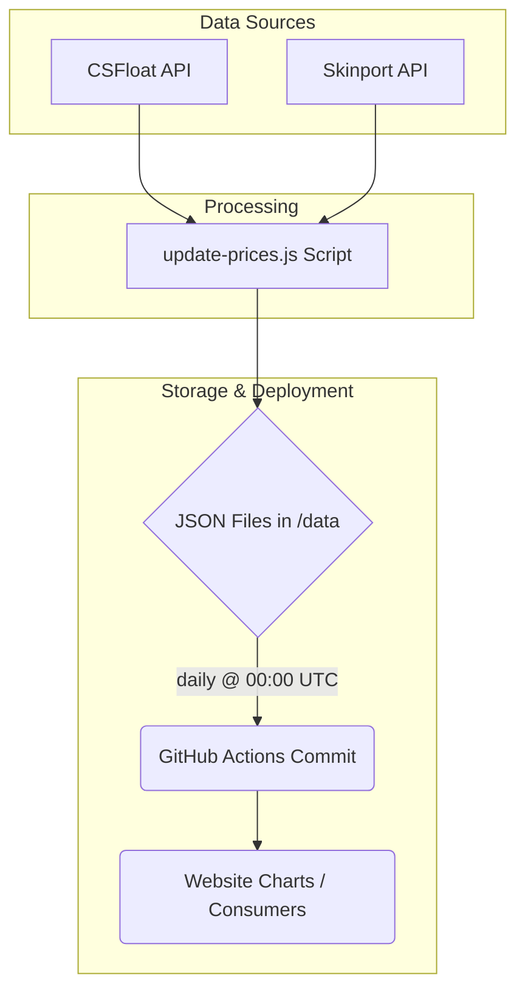

<!-- ────────────────────────────  HERO  ───────────────────────────── -->
<p align="center">
  
</p>

<p align="center">
  
  
  
  
</p>

<h1 align="center">Rick van Iwaarden — Full‑Stack Engineer • Cybersecurity & Healthcare IT</h1>

> A living playground for everything I build, break, and glue back together – from **FHIR‑driven LIS APIs** to **poking at CS2’s memory space**.
> Hosted with ❤️ on **GitHub Pages** and automated through **GitHub Actions**.

---

## 📚 Quick Start

| What              | Where                                                                                                                            |
| :---------------- | :------------------------------------------------------------------------------------------------------------------------------- |
| **Live Site**     | <https://jhviw.github.io>                                                                                                        |
| **Contact**       | `saltssecurity@proton.me`                                                                                                        |
| **Issue Tracker** | [GitHub Issues](../../issues)                                                                                                    |
| **Automation**    | [](/.github/workflows/update-prices.yml) |

---

## 🗂️ Repository Overview

This repository serves as a central hub for various projects, experiments, and portfolio pieces.

```text
.
├── .github/workflows/       # CI/CD pipelines (Pages deploy, CS:GO price job)
├── BP1/                     # Browser phishing POC (uni project)
├── BrowserDataToDiscord/    # Security tool – send browser artefacts to Discord
├── MinecraftSites/          # Legacy static sites for friends' Minecraft servers
├── bushalte-api/            # Dutch public‑transport REST wrapper
├── data/                    # Auto‑updated CS:GO price JSON
├── lingo/                   # Dutch Wordle clone
├── portfolio/               # Main public website (HTML + JS + CSS)
├── prompts/                 # ChatGPT prompt experiments
├── research/                # CVE write‑ups & exploit POCs
├── scripts/                 # Back‑end helpers (update‑prices.js, etc.)
├── vakantie/                # Family travel micro‑site
└── trash/                   # Old assets kept for posterity
```

<details>
  <summary>📊 Language Mix (click to open)</summary>


</details>

---

## 🚀 Highlight Projects

| Project                  | Tech / TL;DR                                 | Live                                                        | Links                                                              |
| :----------------------- | :------------------------------------------- | :---------------------------------------------------------- | :----------------------------------------------------------------- |
| **Secret Santa Bot**     | Discord + Steam automation, 2FA trade offers | —                                                           | [Repo](https://github.com/JHVIW/Secret-Santa-Bot)                  |
| **CS2 External ESP (POC)** | C++ overlay, WinAPI + GDI+, memory scanning  | —                                                           | [Repo](https://github.com/JHVIW/CS2-External-ESP)                  |
| **OV Vertrektijden**     | Live Dutch departures via NS API & OVAPI     | [Live Site](https://jhviw.github.io/OV-Vertrektijden/index.html) | [Repo](https://github.com/JHVIW/OV-Vertrektijden)                  |
| **FHIR $lastn endpoint** | High‑throughput lab results API, NEN 7513 logs | —                                                           | *Private*                                                          |
| **BP1 browser phish**    | Academic research into browser credential theft | [Live Site](https://jhviw.github.io/BP1/)                   | [`BP1/`](BP1)                                                      |
| **bushalte-api**         | Simple REST proxy for OV stop info           | [Live Site](https://jhviw.github.io/bushalte-api/)          | [`bushalte-api/`](bushalte-api)                                    |

---

## 🛠️ Skills & Toolbox

```mermaid
graph LR
    subgraph Languages
        direction LR
        CSharp[C#] --> Python[Python]
        Cpp[C++] --> TS[TypeScript / JS]
        SQL[SQL] --> Bash[Bash]
    end

    subgraph Frameworks
        direction LR
        ASP[ASP.NET Core] --> Node[Node.js]
        Flask[Flask] --> Tailwind[Tailwind CSS]
    end

    subgraph Domains
        direction LR
        FHIR[Healthcare IT (FHIR)] --> Cybersec[Cybersecurity]
        Cybersec --> DevOps[DevOps]
    end

    subgraph Tools
        direction LR
        Azure[Azure] --> GCP[GCP]
        Docker[Docker] --> GHAct[GitHub Actions]
        IaC[IaC (Terraform)]
    end

    Languages --> Frameworks
    Frameworks --> Domains
    Domains --> Tools
```

*   **Cloud & DevOps:** Azure, GCP, Docker, Infrastructure as Code (IaC), GitHub Actions CI/CD
*   **Security:** Reverse Engineering, Vulnerability Research, Ethical Disclosure, Penetration Testing
*   **Healthcare IT:** FHIR R4, HL7 v2/v3, LIS Integration, NEN 7513 / HIPAA Compliance
*   **Other:** REST APIs, WebSockets, Database Design (SQL/NoSQL), Linux/Windows Administration

---

## 🔐 Security Research

Focus areas include application security, reverse engineering, and exploring system internals.

| CVE / Topic                | Year | Summary                                      | Links        |
| :------------------------- | :--- | :------------------------------------------- | :----------- |
| **CVE‑2021‑30481 – Steam RCON** | 2021 | Buffer overflow leading to RCE; mitigations proposed. | [`research/`](research) |
| **Wallhack Detection – CS2** | 2024 | Memory injection study, anti‑cheat heuristics. | [`research/`](research) |

*More detailed write-ups can be found in the [`/research`](research) directory.*

---

## 🏥 FHIR & LIS Work

Experience includes developing and deploying high-availability healthcare solutions. The private **FHIR $lastn** implementation powers real‑time lab dashboards (using LOINC/SNOMED/UCUM standards) and scales to **500 req/s** while maintaining NEN 7513‑compliant audit logging.

*See [`portfolio/fhir.html`](portfolio/fhir.html) for a conceptual overview.*

---

## 🎮 CS:GO/CS2 Skin Pricing Pipeline

Automated pipeline to fetch and update CS:GO/CS2 skin prices daily.



---

## ⚡ Automation

*   **GitHub Pages Deployment:** Automatically deploys the `portfolio/` site on every push to the `main` branch.
*   **Daily Price Update Bot:** Runs via GitHub Actions at 00:00 UTC to refresh price data in the `/data` directory.
    *   Workflow Definition: [`/.github/workflows/update-prices.yml`](.github/workflows/update-prices.yml)

---

## 🤝 Contributing

Contributions, issues, and feature requests are welcome!

1.  **Fork** the repository.
2.  Create your feature branch (`git checkout -b feature/AmazingFeature`).
3.  Commit your changes (`git commit -m 'Add some AmazingFeature'`). Conventional Commits preferred.
4.  Push to the branch (`git push origin feature/AmazingFeature`).
5.  Open a **Pull Request**.

*Please adhere to the `.editorconfig` settings and any language-specific style guides (e.g., [C# Style Guide](STYLEGUIDE.md) if applicable).*

---

## 📝 License

This project is licensed under the MIT License - see the [`LICENSE`](LICENSE) file for details.

---

<p align="center"><b>⭐ If you find something useful here, please consider starring the repository! ⭐</b></p>
