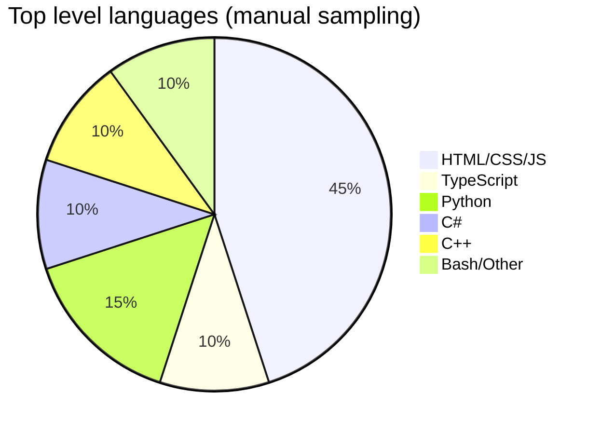
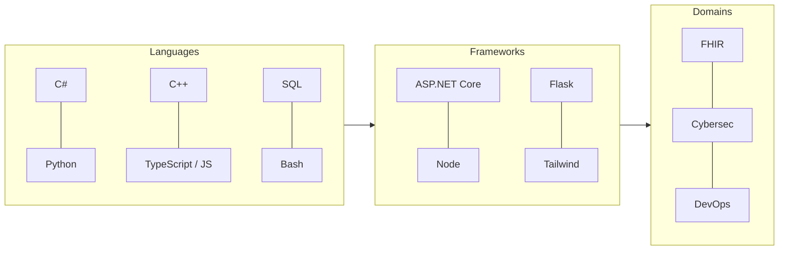
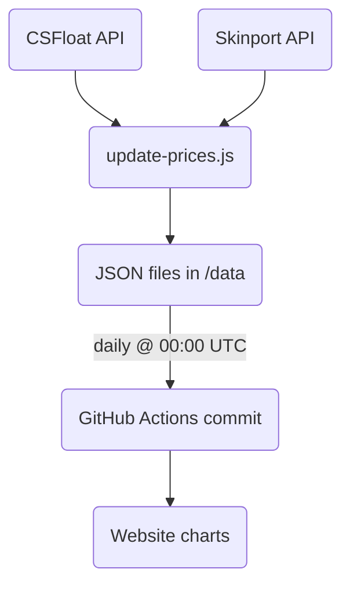

<!-- ────────────────────────────  HERO  ───────────────────────────── -->
<p align="center">
  
</p>

<p align="center">
  
  
  
  
</p>

<h1 align="center">Rick van Iwaarden — Full‑Stack Engineer • Cybersecurity & Healthcare IT</h1>

> A living playground for everything I build, break, and glue back together – from **FHIR‑driven LIS APIs** to **poking at CS2’s memory space**.  
> Hosted with ❤️ on **GitHub Pages** and automated through **GitHub Actions**.

---

## 📚 Quick start

| What | Where |
|------|-------|
| **Live Site** | <https://jhviw.github.io> |
| **Contact** | `saltssecurity@proton.me` |
| **Issue tracker** | [GitHub Issues](../../issues) |
| **Automation status** | See the *Daily Price Update* workflow badge above |

---

## 🗂 Repo overview

```text
.
├── .github/workflows/       # CI / CD pipelines (Pages deploy, CS:GO price job)
├── BP1/                     # Browser phishing POC (uni project)
├── BrowserDataToDiscord/    # Security tool – send browser artefacts to Discord
├── MinecraftSites/          # Legacy static sites for friends' Minecraft servers
├── bushalte-api/            # Dutch public‑transport REST wrapper
├── data/                    # Auto‑updated CS:GO price JSON
├── lingo/                   # Dutch Wordle clone
├── portfolio/               # Main public website (HTML + JS + CSS)
├── prompts/                 # ChatGPT prompt experiments
├── research/                # CVE write‑ups & exploit POCs
├── scripts/                 # Back‑end helpers (update‑prices.js, etc.)
├── vakantie/                # Family travel micro‑site
└── trash/                   # Old assets kept for posterity
```

<details>
  <summary>📊 Language mix (click to open)</summary>


</details>

---

## 🚀 Highlight projects

| Project | Tech / TL;DR | 📎 Links |
|---------|--------------|---------|
| **Secret Santa Bot** | Discord + Steam automation, 2FA trade offers | [Repo](https://github.com/JHVIW/Secret-Santa-Bot) |
| **CS2 External ESP (POC)** | C++ overlay, WinAPI + GDI+, memory scanning | [Repo](https://github.com/JHVIW/CS2-External-ESP) |
| **OV Vertrektijden** | Live Dutch departures via NS API & OVAPI | [Repo](https://github.com/JHVIW/OV-Vertrektijden) |
| **FHIR $lastn endpoint** | High‑throughput lab results API, NEN 7513 logs | *Private* |
| **BP1 browser phish** | Academic research into browser credential theft | [`BP1/`](BP1) |
| **bushalte-api** | Simple REST proxy for OV stop info | [`bushalte-api/`](bushalte-api) |

> *Each sub‑project follows its own README & licence where applicable.*

---

## 🛠️ Skills & toolbox



* **Cloud / DevOps** – Azure & GCP, Docker, IaC, GitHub Actions  
* **Security** – reverse engineering, vulnerability research, ethical disclosure  
* **Healthcare IT** – FHIR R4, HL7 v2/v3, LIS integration  

---

## 🔐 Security research

| CVE / Topic | Year | Summary |
|-------------|------|---------|
| **CVE‑2021‑30481 – Steam RCON** | 2021 | Buffer overflow → RCE; mitigations proposed. |
| **Wallhack detection – CS2** | 2024 | Memory injection study, anti‑cheat heuristics. |

Detailed write‑ups are available in [`/research`](research).

---

## 🏥 FHIR & LIS work

The private **FHIR $lastn** implementation powers real‑time lab dashboards (LOINC/SNOMED/UCUM) and scales to **500 req/s** with NEN 7513‑compliant audit logging. See [`portfolio/fhir.html`](portfolio/fhir.html) for an architectural tour.

---

## 🎮 CS:GO/CS2 skin pricing pipeline



---

## ⚡ Automation

* **GitHub Pages** – deploys on every push to `main`.  
* **Daily price bot** – runs at 00:00 UTC, refreshes `/data`. Status badge is in the header.  

Workflow definition: [`/.github/workflows/update-prices.yml`](.github/workflows/update-prices.yml)

---

## 🤝 Contributing

1. **Fork** ➜ **branch** ➜ PR (conventional commits preferred).  
2. Bug reports / feature requests → GitHub Issues.

---

## 📝 Licence

MIT – see [`LICENSE`](LICENSE) for details.

---

<p align="center"><b>⭐&nbsp; If something here helped you, a star is always appreciated!</b></p>
